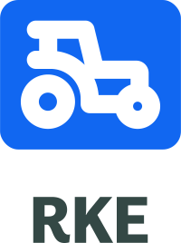
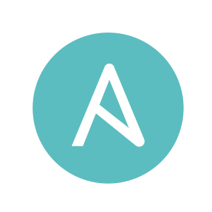
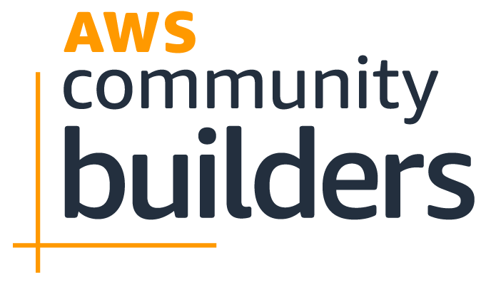
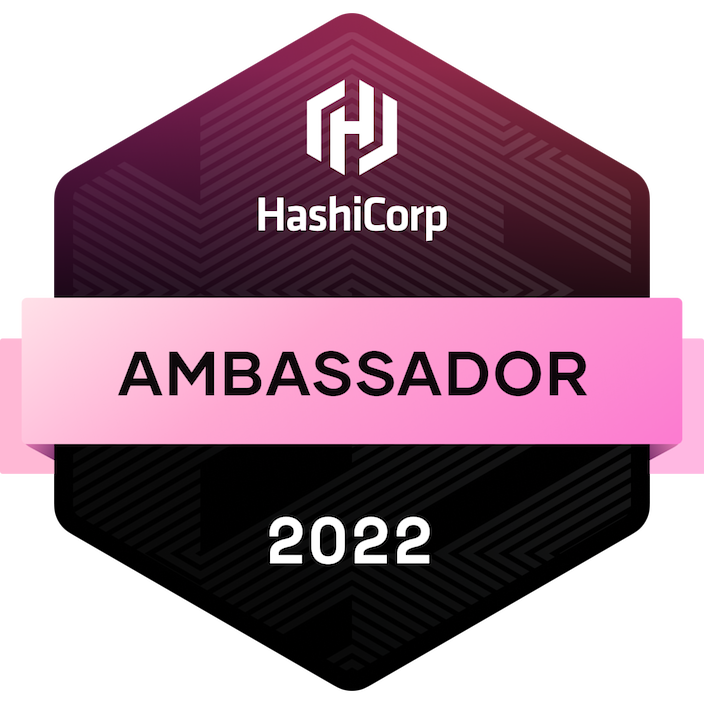
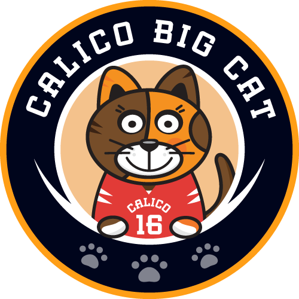
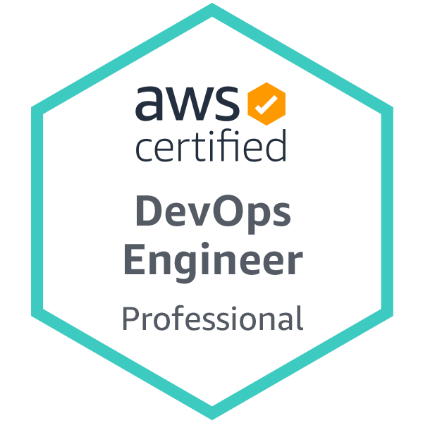
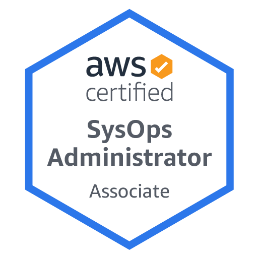
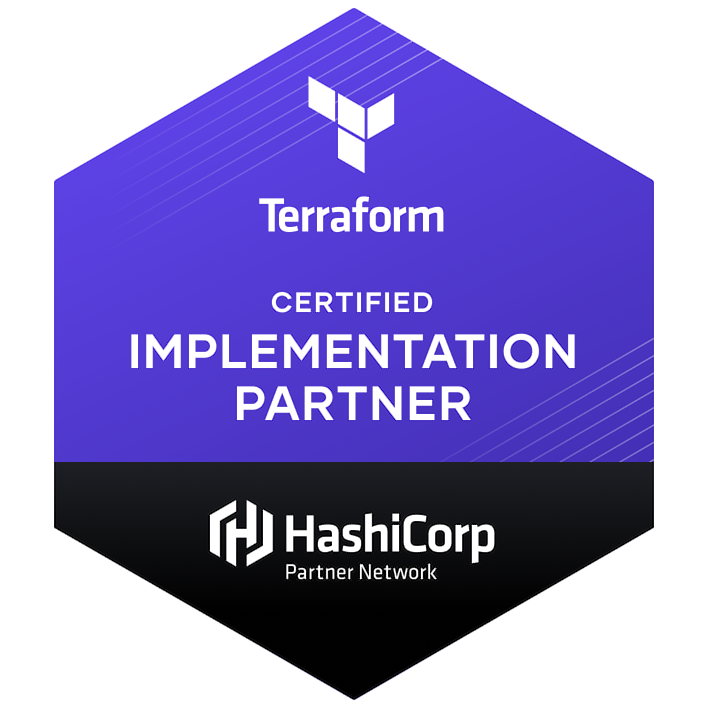
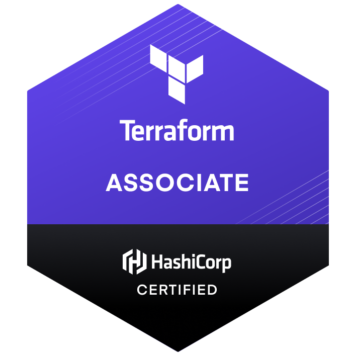

### Hi there 👋

  
  
  

Hello, I'm [Emin Alemdar](https://twitter.com/alemdar_emin), working as Cloud Native Engineer at [Container Solutions](https://www.container-solutions.com). I am an **AWS Community Builder** in ***Containers*** category. I am also ***HashiCorp Ambassador*** in the Open Source Community and ***Calico Big Cats Ambassador***.

**🔭 I’m currently working on**

                  

**Certificates**

           

**Learning new things every day!**

``It is not the strongest of the species that survive, nor the most intelligent, but the one most responsive to change.``

### Latest Blog Posts
<!-- BLOG-POST-LIST:START -->
- [External Secrets Operator Integration with HashiCorp Vault](https://eminalemdar.medium.com/external-secrets-operator-integration-with-hashicorp-vault-aff3f956237b?source=rss-b3bf23b97abd------2)
- [Cloud Native Secret Management with External Secrets Operator](https://eminalemdar.medium.com/cloud-native-secret-management-with-external-secrets-operator-2912f41f9c49?source=rss-b3bf23b97abd------2)
- [Manage Your AWS Resources from Kubernetes with ACK](https://eminalemdar.medium.com/manage-your-aws-resources-from-kubernetes-with-ack-3cf06a4b0770?source=rss-b3bf23b97abd------2)
- [New Way of HCI — Harvester](https://blog.kloia.com/new-way-of-hci-harvester-a2440002a628?source=rss-b3bf23b97abd------2)
- [Karpenter Cluster Autoscaler](https://blog.kloia.com/karpenter-cluster-autoscaler-76d7f7ec0d0e?source=rss-b3bf23b97abd------2)
<!-- BLOG-POST-LIST:END -->
