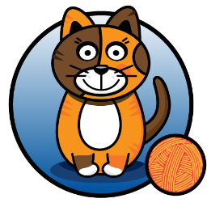

### Hi there 👋

  
  
  

Hello, I'm [Emin Alemdar](https://twitter.com/alemdar_emin), working as Cloud and DevOps Consultant. I am an **AWS Community Builder** in ***Containers*** category.

**🔭 I’m currently working on**

                  

**Certificates**

       

**Learning new things every day!**

``It is not the strongest of the species that survive, nor the most intelligent, but the one most responsive to change.``

### Latest Blog Posts
<!-- BLOG-POST-LIST:START -->
- [Using Amazon’s Kubernetes Distribution Everywhere with Amazon EKS Distro](https://blog.kloia.com/using-amazons-kubernetes-distribution-everywhere-with-amazon-eks-distro-5ee7c00326d5?source=rss-b3bf23b97abd------2)
- [Run Amazon ECS Anywhere!](https://blog.kloia.com/run-amazon-ecs-anywhere-fa5007690fcd?source=rss-b3bf23b97abd------2)
- [Run Amazon EKS Anywhere!](https://blog.kloia.com/run-amazon-eks-anywhere-523b0c49b4ab?source=rss-b3bf23b97abd------2)
- [Comparing Unseal Options in HashiCorp Vault](https://blog.kloia.com/comparing-unseal-options-in-hashicorp-vault-c71cd8f8a1df?source=rss-b3bf23b97abd------2)
- [CloudWatch Container Insights for Amazon EKS Clusters](https://blog.kloia.com/cloudwatch-container-insights-for-amazon-eks-clusters-f3fd028ff7e9?source=rss-b3bf23b97abd------2)
<!-- BLOG-POST-LIST:END -->
